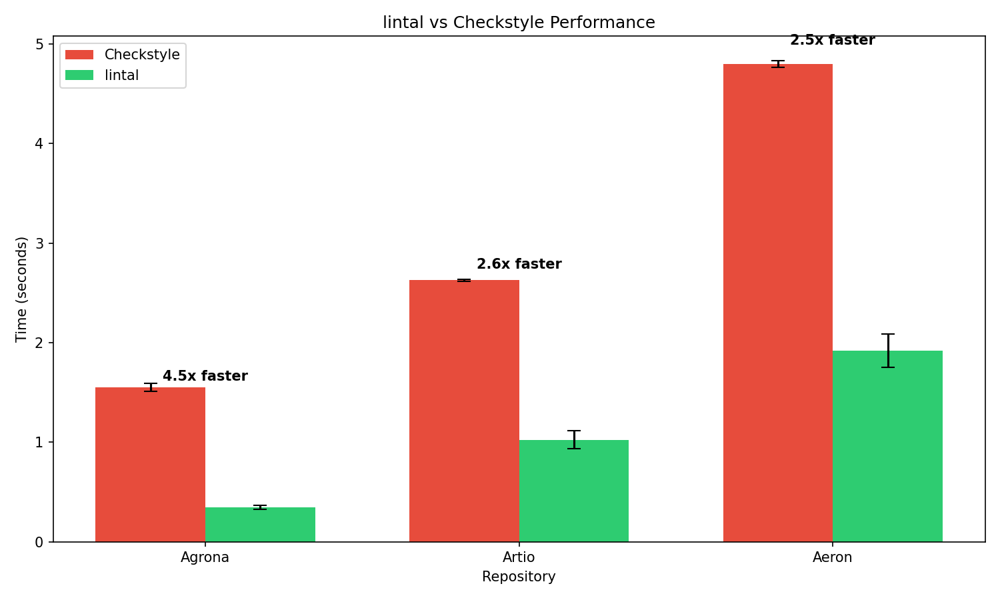

# lintal

A fast Java linter with auto-fix support, built in Rust.

lintal reads checkstyle.xml configuration files and can automatically fix many violations that checkstyle can only detect.

> **Attribution**: lintal is built on infrastructure from [Ruff](https://github.com/astral-sh/ruff), the extremely fast Python linter by [Astral](https://astral.sh/). We're grateful to the Ruff team for their excellent work that made this project possible.

## Current Status

⚠️ Early Development — lintal is in active early development. Use at your own risk and always verify changes before committing.

The project focuses on safely autofixable cases and aims for 100% compatibility with Checkstyle. We validate against Checkstyle's own test suite (downloaded during testing) and run against real-world projects including [Aeron](https://github.com/aeron-io/aeron), [Artio](https://github.com/artiofix/artio), and [Agrona](https://github.com/aeron-io/agrona)  to catch false positives.

### Why we built this

In several projects I work on, we use restrictive (and somewhat non-traditional) Java checkstyle rules. Coding agents like Claude Code, Codex, and others rarely get the format correct, so a typical session involves the agent writing code, then spending time fixing checkstyle violations. lintal sits in the middle of that workflow:

1. The agent writes code
2. lintal reviews and fixes what it can (using the project's checkstyle rules)
3. Checkstyle validates the result

Since introducing lintal, we're spending less time on the checkstyle step—giving us readable, consistent code with faster iterations.

## Performance

lintal is significantly faster than checkstyle due to native compilation and parallel processing (along with the Ruff heritage).

**Benchmark vs Checkstyle 13.0.0** (same files, 33 of 39 supported rules including Indentation and Naming, 10 runs each after warmup):

| Repository | Files | Checkstyle | lintal | Speedup |
|------------|-------|------------|--------|---------|
| Agrona | 289 | 1.57s ± 0.01s | 0.19s ± 0.01s | **8.4x** |
| Artio | 726 | 2.72s ± 0.01s | 0.40s ± 0.03s | **6.7x** |
| Aeron | 935 | 4.90s ± 0.04s | 0.90s ± 0.13s | **5.4x** |



Key factors:
- Native binary with no JVM startup overhead
- Parallel file processing (utilizes all CPU cores)
- Efficient tree-sitter parsing

Run benchmarks yourself: `mise run benchmark`

## Features

- Reads existing checkstyle.xml configurations
- Auto-discovers config in standard locations (`config/checkstyle/checkstyle.xml`)
- Auto-fixes many common violations (whitespace, brace placement, modifiers)
- Fast parallel processing
- Suppression support:
  - `@SuppressWarnings("checkstyle:RuleName")` or `@SuppressWarnings("RuleName")` annotations
  - `SuppressWithPlainTextCommentFilter` (`// CHECKSTYLE:OFF:RuleName` comments)
  - `SuppressWarningsFilter`
  - `SuppressionFilter` (file-based suppressions via `suppressions.xml`)
- Optional TOML overlay for fix-specific settings

## Installation

lintal supports macOS and Linux. Windows support is a non-goal.

| Distribution   | Status  | Command                                          |
|----------------|---------|--------------------------------------------------|
| GitHub Release | [v0.1.6](https://github.com/eleventy7/lintal/releases/tag/v0.1.6) | Direct download |
| Homebrew       | Working | `brew tap eleventy7/lintal && brew install lintal` |
| mise ubi       | Ready   | `mise use ubi:eleventy7/lintal`                  |

### Build from source

```bash
cargo install --path crates/lintal
```

## Usage

```bash
# Check files for violations
lintal check src/

# Fix violations
lintal fix src/

# Use specific checkstyle config
lintal check src/ --config path/to/checkstyle.xml

# Show fixes without applying
lintal fix src/ --diff
```

## Supported Rules

lintal currently implements 39 checkstyle rules. We validate against checkstyle's own test fixtures and real-world projects.

**Status key:**
- ✓ = Passes all checkstyle test fixtures
- *89%* = Detection rate on test fixtures (prioritizes zero false positives)

All rules achieve zero false positives on real-world projects (Aeron, Artio, Agrona).

### Whitespace (13 rules)

| Rule | Auto-fix | Status |
|------|----------|--------|
| WhitespaceAround | ✅ | ✓ |
| WhitespaceAfter | ✅ | ✓ |
| NoWhitespaceAfter | ✅ | ✓ |
| NoWhitespaceBefore | ✅ | ✓ |
| SingleSpaceSeparator | ✅ | ✓ |
| ParenPad | ✅ | ✓ |
| TypecastParenPad | ✅ | ✓ |
| MethodParamPad | ✅ | ✓ |
| EmptyForInitializerPad | ✅ | ✓ |
| FileTabCharacter | ✅ | ✓ |
| OperatorWrap | ✅ | ✓ |
| EmptyLineSeparator | ❌ | ✓ |
| Indentation | ✅ | 89% |

### Blocks (6 rules)

| Rule | Auto-fix | Status |
|------|----------|--------|
| LeftCurly | ✅ (partial) | ✓ |
| RightCurly | ✅ (partial) | ✓ |
| NeedBraces | ❌ | ✓ |
| EmptyBlock | ❌ | ✓ |
| EmptyCatchBlock | ❌ | ✓ |
| AvoidNestedBlocks | ❌ | ✓ |

### Modifiers (4 rules)

| Rule | Auto-fix | Status |
|------|----------|--------|
| ModifierOrder | ✅ | ✓ |
| RedundantModifier | ✅ | ✓ |
| FinalParameters | ✅ | ✓ |
| FinalLocalVariable | ✅ | ✓ |

### Miscellaneous (2 rules)

| Rule | Auto-fix | Status |
|------|----------|--------|
| UpperEll | ✅ | ✓ |
| ArrayTypeStyle | ✅ | ✓ |

### Imports (2 rules)

| Rule | Auto-fix | Status |
|------|----------|--------|
| UnusedImports | ✅ | ✓ |
| RedundantImport | ✅ | ✓ |

### Coding (3 rules)

| Rule | Auto-fix | Status |
|------|----------|--------|
| OneStatementPerLine | ✅ | ✓ |
| MultipleVariableDeclarations | ✅ (partial) | ✓ |
| SimplifyBooleanReturn | ❌ | ✓ |

### Naming (9 rules)

| Rule | Auto-fix | Status |
|------|----------|--------|
| ConstantName | ❌ | ✓ |
| TypeName | ❌ | ✓ |
| MethodName | ❌ | ✓ |
| MemberName | ❌ | ✓ |
| ParameterName | ❌ | ✓ |
| LocalVariableName | ❌ | ✓ |
| LocalFinalVariableName | ❌ | ✓ |
| StaticVariableName | ❌ | ✓ |
| PackageName | ❌ | ✓ |

## Development

```bash
# Build
cargo build

# Run tests
cargo test

# Run on a Java project
cargo run -- check /path/to/java/src
```

## Acknowledgments

This project builds on the excellent work of:

- [Ruff](https://github.com/astral-sh/ruff) - The core infrastructure (diagnostics, text handling, fix application) is derived from Ruff's codebase
- [tree-sitter-java](https://github.com/tree-sitter/tree-sitter-java) - Java parsing via tree-sitter
- [Checkstyle](https://checkstyle.org/) - The original Java style checker whose configurations we support

## License

MIT - See [LICENSE](LICENSE) and [NOTICE](NOTICE) for details.
